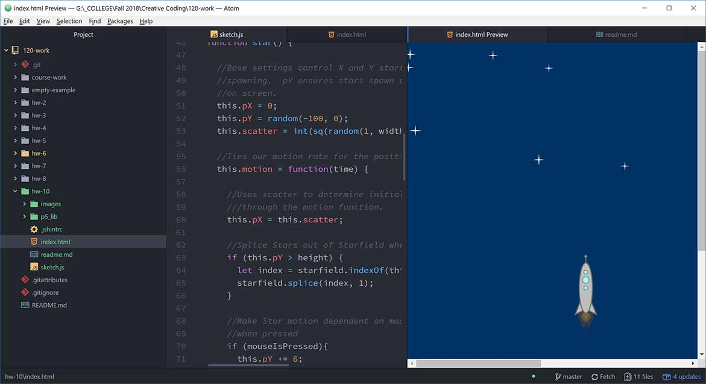

## Don-Vincent Snell

[Let's go to SPAAAAAAACE!](https://dvsnell.github.io/120-work/hw-10/)

* It was nice to step away from abstract generators for awhile so I went to another passion: Interactive SPACE!  I'm still trying to grok functions and nested functions and their interactions, but it's becoming clearer the more I stare at it.  Arrays bother me but its probably just PTSD from math class and matrices and their apparent similarities.  Those block brackets are scary.   

* This was an interesting project because so many things could break without throwing a linter or devtool error.  It was filled with perfectly acceptable code that didn't actually work.  I tackled a small mountain of research and vivisected a ton of other code snippets to get the effect I wanted.  I'm pretty happy with this peace and can already see how I can further streamline it and add to it.  I also learned a few new tricks like for of loops and more splice tricks.

* More debugging and some syntax clarification this week.  I didn't have any issues that required assistance beyond google, though.
