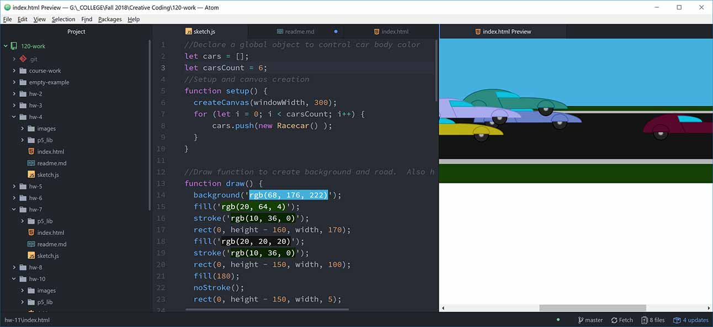

## Don-Vincent Snell

[Vrooom!](https://dvsnell.github.io/120-work/hw-11/)

* Still trying to stay away from abstract designs, though the pull is strong.  I was wondering when we'd get into OOP and am happy it wasn't reserved to Creative Coding II.  OOP is so useful and common that it was great to finally give it a spin in p5. 

* I ran out of time chasing collision avoidance on this one.  I trimmed out all the unnecessary code, but I had gotten as far as bounding boxes and starting to track distances between the objects.  I think the issue I was running into was arrayed objects interacting with each other and themselves.  It was an interesting experiment to be sure.  However, in the process of falling down that particular rabbit hole, I forgot to create a moving background to generate a sense of motion in the scene.  I plan on going back to this piece and adding some cloud layers, a central dotted line, and maybe signs and trees.  as it is, it makes for an interesting website header.  I'm curious about overlapping/underlapping objects (Ex. car 1 initially being drawn under car 2, but after passing, being drawn over car 2.) in animation.

* There weren't any questions in the forum this week, so I just chugged along on the project and my independent research.
