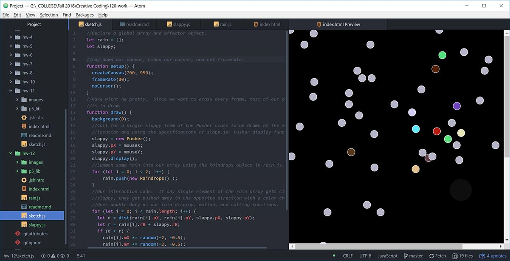

## Don-Vincent Snell

[Effects on Others](https://dvsnell.github.io/120-work/hw-12/)

* Danced into something a little abstract.  Still trying to wrap my head around AABB collision and it's a hoot.  I'm so used to just loading up some objects, dropping in dynamics and letting the sims do their thing.  I'm pretty sure designing the underlying software is not for me.  The math alone would drive me up a wall.  But it was nice looking behind the curtain. 

* This was another assignment that had a mountain of "Code is Error Free.  You see... Nothing," which is to be expected as we ramp complexity.  Getting the *.js files to talk to each other wasa bit of a chore and I had to basiccally burn the project to the ground a few times to get what I wanted out of it.  Overall, I'm pretty happy with my metaphor on the people passing through our lives and our effect on them.

Some earlier versions wre quite a hoot.  It's funny what you can make if you flip our operator signs around.  I had a crude MagnaDoodle at one point that I might kick into a seperate project.  It was spiffy.

Haven't quite figured out the position shifts of the "rain" though... More research required.

* Didn't have a lot of time to cut into the forums, but I did spend a fair chunk helping other with the previous weeks project.  Debugging is fun.  I'm sure I'll have more to look forward to.
