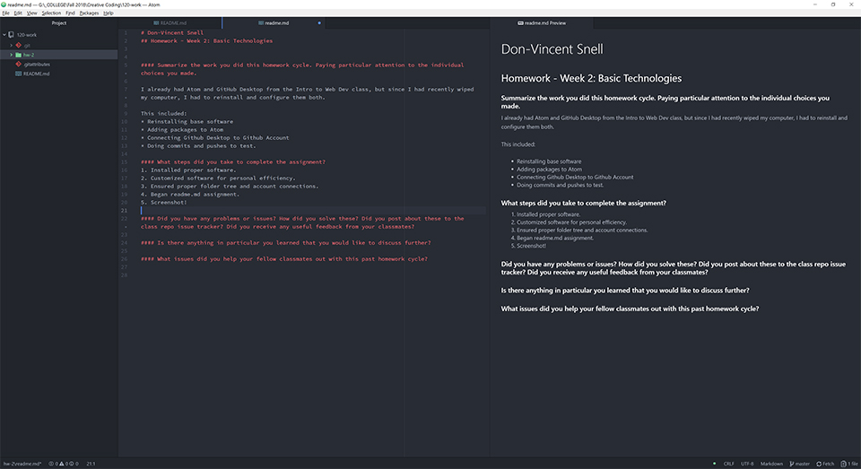

# Don-Vincent Snell
## Homework - Week 2: Basic Technologies

#### Summarize the work you did this homework cycle. Paying particular attention to the individual choices you made.

I already had Atom and GitHub Desktop from the Intro to Web Dev class, but since I had recently wiped my computer, I had to reinstall and configure them both.

This included:
* Reinstalling base software
* Adding packages to Atom
* Connecting Github Desktop to Github Account
* Doing commits and pushes to test.

#### What steps did you take to complete the assignment?

1. Installed proper software.
2. Customized software for personal efficiency.
3. Ensured proper folder tree and account connections.
4. Began readme.md assignment.
5. Screenshot!
6. Complete readme.md assignment.
7. Commit, Push, and Submit Homework.

#### Did you have any problems or issues? How did you solve these? Did you post about these to the class repo issue tracker? Did you receive any useful feedback from your classmates?

I ran into no issues with this assignment that required outside assistance.

#### Is there anything in particular you learned that you would like to discuss further?

I was always a CMD guy, but with the shift to PowerShell, I've started looking for assets to make a shift to it.  A pretty good one is the [Microsoft Visual Academy's Getting Started with PowerShell course](https://mva.microsoft.com/en-us/training-courses/getting-started-with-powershell-3-0-jump-start-8276)

If you don't trust random links, you can copy the link here:
`[Microsoft Visual Academy's Getting Started with PowerShell course](https://mva.microsoft.com/en-us/training-courses/getting-started-with-powershell-3-0-jump-start-8276)`
#### What issues did you help your fellow classmates out with this past homework cycle?

I have helped a couple students with basic Markdown formatting issues and some more common problems.  It seems we should reinforce the "Save, Commit, Push" and "Save Often!" mantras a bit more.

## Workspace Screenshot for hw-2

