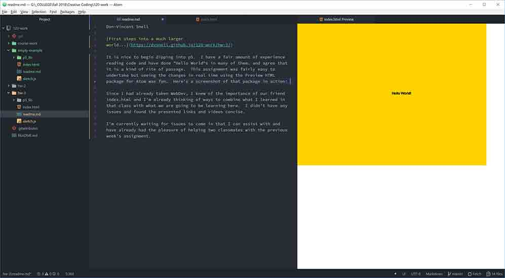

## Don-Vincent Snell

[First steps into a much larger world...](https://dvsnell.github.io/120-work/hw-3/)

* It is nice to begin dipping into p5.  I have a fair amount of experience reading code and have done "Hello World"s in many of them. and agree that it is a kind of rite of passage.  This assignment was fairly easy to undertake but seeing the changes in real time using the Preview HTML package for Atom was fun.  Here's a screenshot of that package in action: 

* Since I had already taken WebDev, I knew of the importance of our friend index.html and I'm already thinking of ways to combine what I learned in that class with what we are going to be learning here.  ~~I didn't have any issues and found the presented links and videos concise.~~ Correction:  For some reason, I was having a problem spelling "Hello".  I kept spelling it "Hellow"  Must be the proximity to October...

* ~~I'm currently waiting for issues to come in that I can assist with and have already had the pleasure of helping two classmates with the previous week's assignment.~~  Sure were a lot of issues this go around.  Some stemmed from misunderstanding the instructions, some were plain old technical issues, and a few were due to lack of experience with computers.  The most common seemed to be issues going live and there were a multitude of solutions that ended up working, from cleaning up repositories, double checking URLs, and good old patience.  I'm used to being Tech Support and am actually happy to help people out, so long as I have the time, which these early projects provide.  I expect it will taper off as the projects become more complex, but I'll still try my best.
