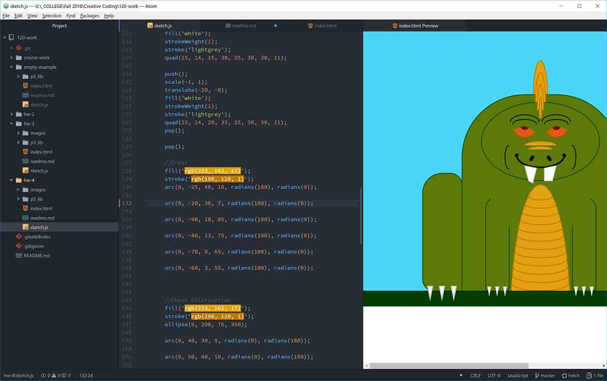

## Don-Vincent Snell

[Everyone wants a Drangom for a friend.](https://dvsnell.github.io/120-work/hw-4/)

* This was a pretty straightforward assignment.  I found it fun to think of creative ways to problem solv.  Creating different shapes from the assorted tools was interesting. 

* No real issues except some positioning hiccups.  Once I moved the origin to the center, I could use my previous experience of thinking in 3D space to better visualize how things would move.

* I've helped a few students with generic problems and even a bit of de-bugging.  It does seem like this assignment was less difficult since we hamemred out most of the GitHub/Atom issues.
