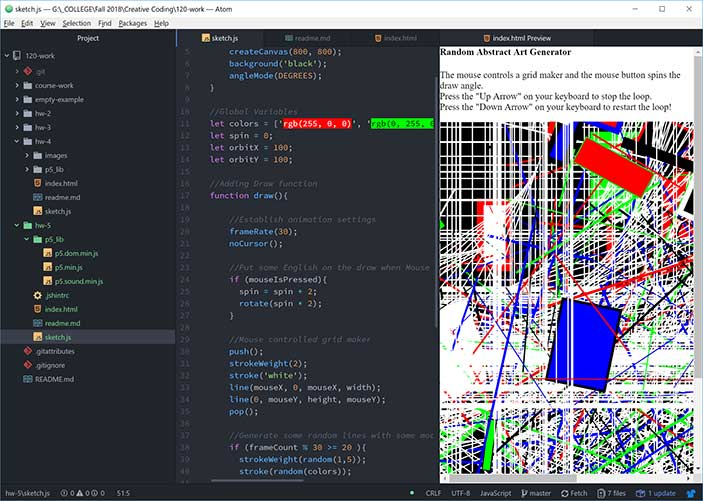

## Don-Vincent Snell

[Random Abstract Art Generator (v 0.1)](https://dvsnell.github.io/120-work/hw-4/)

* I let myself research more complex systems and experimented a lot, but settled on a fairly simple creation for this assignment.  I've always loved procedural generators and abstract things like IFS fractals were the origin of my digital art creative career.  I felt it would be appropriate to make a little "art generator", great for decorating your upscale apartment (or dorm room).   

* Found a problem with `translate` and `mouseX` interactions while experimenting that had me chasing rabbits on forums for a while, but there was nothing really showstopping this time around.

* More fun in the issues forums including some debugging and idea swapping.  It's nice to see more people getting involved and more complex ideas being put forward.  I think everyone is starting to see what can be done with fairly simple code.
