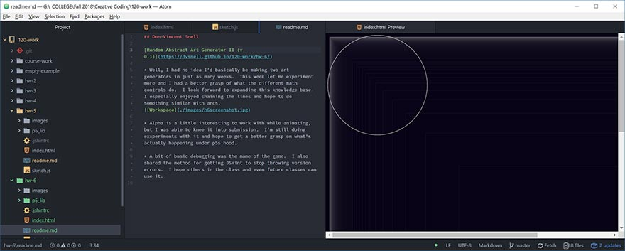

## Don-Vincent Snell

[Random Abstract Art Generator II (v 0.1)](https://dvsnell.github.io/120-work/hw-6/)

* Well, I had no idea I'd basically be making two art generators in just as many weeks.  This week let me experiment more and I had a better grasp of what the different math controls do.  I look forward to expanding this knowledge base.  I especially enjoyed chaining the lines and hope to do something similar with arcs.  

* Alpha is a little interesting to work with while animating, but I was able to knee it into submission.  I'm still doing exxperiments with it and hope to get a better grasp on what's actually happening under p5s hood.

* A bit of basic debugging was the name of the game.  I also shared the method for getting JSHint to stop throwing version errors.  I hope others in the class and even future classes can use it.
