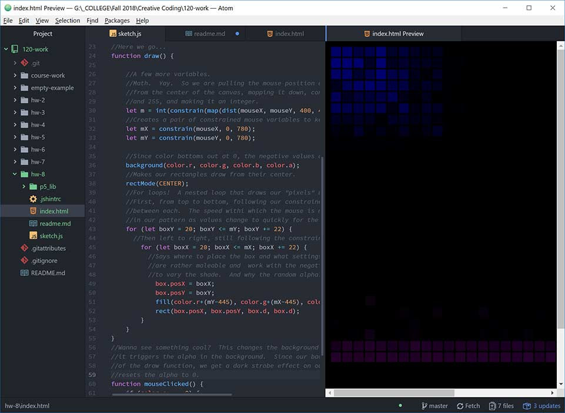

## Don-Vincent Snell
### MART 120.50

[Pixel Painter](https://dvsnell.github.io/120-work/hw-8/)

* I had been wondering about the syntax used for loops in p5 for a while now, but held off diggin into it since I was already exploring so many other tangents.  I like how much looping simplifies my code allowing for complex actions with a sensible amount of lines.  I'm also trying to step up my commenting game since I tend to suck at it. 

* Driving effects with the mouse is still a bit confusing to me, but the most challenging thing for me to wrap my head around is the "background wipes everything" method of animation.  I'm so used to persistant placement or independent object actions that I've been finding it tricky to get the results I'm looking for.  This is mostly just the establishment of new ways of thinking that I have to get used to.

* Not a lot of problems in the forums this week.  It seems as though people have found their groove.  I didn't need to post there either, as most of the tiny issues I ran into were either syntax related or easily solved with a google search.
